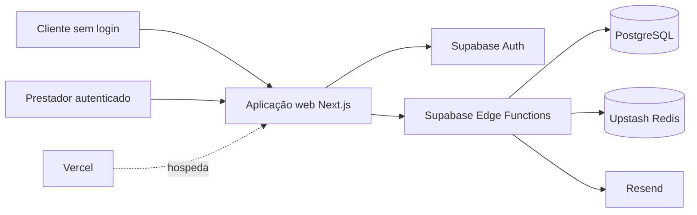

# Sistema de Agendamento

PWA mobile-first para que microempreendedores publiquem sua disponibilidade e recebam agendamentos, enquanto clientes consultam horários, reservam e cancelam sem criar uma conta.

> [!IMPORTANT]
> Este repositório está em fase de inicialização. Neste momento, ele contém somente o scaffold web criado com Next.js. Supabase, PostgreSQL, Edge Functions, Upstash Redis, Resend, PWA, testes, observabilidade e CI/CD fazem parte da arquitetura-alvo documentada, mas ainda não estão implementados. Consulte [Estado atual](#estado-atual) e [STACK.md](./STACK.md) antes de assumir que uma integração já existe.

## Sumário

- [Visão geral](#visão-geral)
- [Estado atual](#estado-atual)
- [Problema e proposta de valor](#problema-e-proposta-de-valor)
- [Público e stakeholders](#público-e-stakeholders)
- [Escopo do MVP](#escopo-do-mvp)
- [Fora do escopo inicial](#fora-do-escopo-inicial)
- [Atores e permissões](#atores-e-permissões)
- [Jornadas principais](#jornadas-principais)
- [Requisitos funcionais](#requisitos-funcionais)
- [Regras de negócio](#regras-de-negócio)
- [Casos de uso](#casos-de-uso)
- [Requisitos não funcionais](#requisitos-não-funcionais)
- [Arquitetura](#arquitetura)
- [Estrutura do repositório](#estrutura-do-repositório)
- [Como executar o projeto atual](#como-executar-o-projeto-atual)
- [Configuração por ambiente](#configuração-por-ambiente)
- [Qualidade e testes](#qualidade-e-testes)
- [Segurança e privacidade](#segurança-e-privacidade)
- [PWA, acessibilidade e redes limitadas](#pwa-acessibilidade-e-redes-limitadas)
- [Fluxo de trabalho](#fluxo-de-trabalho)
- [Roadmap de implementação](#roadmap-de-implementação)
- [Decisões em aberto](#decisões-em-aberto)
- [Rastreabilidade](#rastreabilidade)
- [Troubleshooting](#troubleshooting)
- [Fontes e governança da documentação](#fontes-e-governança-da-documentação)

## Visão geral

O Sistema de Agendamento busca oferecer uma experiência simples, econômica em dados e adequada ao uso em celulares. O prestador administra um único perfil e sua própria agenda. O cliente abre o link público desse prestador, consulta horários livres, informa dados básicos e conclui a reserva sem autenticação.

O primeiro incremento completo esperado é:

1. o prestador autentica e configura a agenda;
2. o cliente consulta a disponibilidade pelo link público;
3. o cliente cria uma reserva sem login;
4. o prestador visualiza a reserva na agenda;
5. o cliente ou o prestador cancela com autorização adequada;
6. o horário cancelado volta a poder ser reservado.

O produto deve privilegiar integridade sobre conveniência: nenhuma otimização de cache ou interface pode permitir reservas duplicadas, exposição de dados pessoais ou cancelamentos não autorizados.

## Estado atual

Legenda usada nesta documentação:

- **Implementado:** existe no repositório e pode ser verificado localmente.
- **Planejado:** aprovado como direção técnica ou requisito, mas ainda sem implementação neste repositório.
- **Pendente de decisão:** depende de uma decisão de produto ou arquitetura registrada no Trello.

| Área | Estado | Evidência ou observação |
| --- | --- | --- |
| Aplicação web Next.js | Implementado | App Router mínimo em `app/`, ainda com a página padrão do `create-next-app` |
| React e TypeScript estrito | Implementado | React 19.2.8; `strict: true` e `noEmit: true` no TypeScript |
| Tailwind CSS | Implementado no scaffold | Tailwind 4 integrado via PostCSS; ainda sem design system do produto |
| ESLint | Implementado | ESLint 9 com regras Next.js Core Web Vitals e TypeScript |
| Funcionalidades de agendamento | Planejado | Nenhum fluxo de domínio foi implementado |
| PWA instalável | Planejado | Manifest, ícones próprios e service worker ainda não existem |
| Supabase Auth | Parcial | Clientes `@supabase/ssr`, `useSession` / `useSignIn` / `useSignOut`; projeto Auth ainda não configurado |
| PostgreSQL, migrations e RLS | Planejado | Contrato em `docs/schema.prisma`; sem Prisma Client nem migrations no web |
| Supabase Edge Functions | Parcial | Contratos e hooks em `src/features`; funções ainda não deployadas |
| Upstash Redis | Planejado | Cache e invalidação ainda não existem |
| Resend | Planejado | Envio resiliente de emails ainda não existe |
| Testes automatizados | Parcial | Vitest cobre mapper, `invokeFunction`, Auth, disponibilidade, reserva, cancelamento, perfil, regras, exceções, agenda, clientes, cancelamento do prestador e o proxy de sessão |
| Camada web de API | Implementado | `docs/supabase.md`, `docs/integracao.md` e hooks por caso de uso |
| CI/CD e observabilidade | Planejado | Não há workflows ou instrumentação versionados |
| Regras de duração, fuso e precedência | Pendente de decisão | Bloqueadas por DEC-01 |
| Política transacional e de acesso | Pendente de decisão | Bloqueada por DEC-02 |
| Identidade dos clientes | Pendente de decisão | Bloqueada por DEC-03 |
| Política final de cancelamento e emails | Pendente de decisão | Bloqueada por DEC-04 |

## Problema e proposta de valor

### Problema

Microempreendedores frequentemente coordenam horários por mensagens, planilhas ou agendas manuais. Esse processo consome tempo, gera desencontros e pode exigir ferramentas desproporcionais ao orçamento ou à maturidade digital do negócio.

### Proposta de valor

O sistema pretende permitir que o prestador:

- divulgue um link curto associado a um slug único;
- configure dias, intervalos recorrentes e exceções;
- acompanhe agenda e clientes vinculados;
- cancele atendimentos sem apagar o histórico;
- reduza trabalho manual com confirmação por email.

Para o cliente, a proposta é:

- não exigir cadastro, login ou senha;
- funcionar bem em telas pequenas e redes limitadas;
- apresentar somente horários realmente disponíveis;
- concluir a reserva em até três etapas;
- permitir cancelamento seguro por link.

## Público e stakeholders

| Stakeholder | Interesse principal | Responsabilidade ou impacto |
| --- | --- | --- |
| Prestador MEI | Organizar o tempo, reduzir custo e receber reservas | Configura o perfil e a disponibilidade; administra somente seus dados |
| Cliente final | Reservar ou cancelar rapidamente, sem conta | Fornece nome, email e telefone no momento da reserva |
| Equipe/autoria do TCC | Entregar e avaliar a solução | Implementa, testa, documenta e apresenta evidências |
| Orientação e banca | Validar coerência e resultados | Avalia requisitos, método, implementação e evidências |
| Product Owner, a identificar | Priorizar e aceitar mudanças | Resolve divergências e aprova decisões de produto |
| Desenvolvimento e QA, a identificar | Construir e verificar | Atende critérios, automatiza testes e registra evidências |
| Operação/suporte, a identificar | Manter o serviço confiável | Responde a incidentes, custos, restauração e comunicação |

Supabase Auth e Resend são atores externos em integrações específicas. Vercel e Upstash são dependências técnicas da solução, não atores funcionais do negócio.

## Escopo do MVP

O MVP considera **um prestador administrando uma agenda própria** e **clientes sem conta**.

### Área do prestador

- autenticação por email/senha ou provedor social;
- criação e edição do perfil;
- definição de slug público único;
- CRUD de grupos de disponibilidade;
- ativação e desativação de grupos sem conflitos;
- configuração de intervalos semanais;
- cadastro de bloqueios e horários extras;
- consulta da agenda diária;
- visualização dos clientes vinculados ao próprio prestador;
- cancelamento de reservas próprias;
- notificação por email quando aplicável.

### Área pública do cliente

- abertura da agenda pelo slug do prestador;
- escolha da data e consulta de horários livres;
- reserva com nome, email e telefone;
- criação ou associação segura do cliente ao prestador;
- confirmação por email;
- recebimento de link de cancelamento;
- cancelamento pelo link, sem autenticação, após confirmação explícita.

### Compromissos transversais

- experiência mobile-first;
- possibilidade de instalação como PWA;
- baixo consumo de dados;
- disponibilidade calculada com regras, exceções e reservas confirmadas;
- prevenção de reservas sobrepostas no banco;
- autorização por proprietário na área privada;
- exposição mínima de informações na área pública;
- preservação do histórico de reservas canceladas, sujeita à confirmação de DEC-04.

## Fora do escopo inicial

Os seguintes itens não pertencem ao compromisso inicial do MVP e só devem ser iniciados após validação explícita:

- catálogo de serviços ou durações diferentes por serviço;
- múltiplos funcionários por conta;
- alocação de salas, equipamentos ou outros recursos;
- reagendamento atômico;
- lembretes automáticos;
- WhatsApp ou outros canais adicionais;
- cobrança, assinatura ou monetização;
- relatórios avançados;
- confirmação offline de reservas.

Também não há justificativa atual para dois frontends separados ou para um backend Java. A direção registrada é uma aplicação web única e uma API baseada em Supabase Edge Functions.

## Atores e permissões

### Prestador autenticado

Pode acessar e modificar somente o próprio perfil, grupos, regras, exceções, agenda, reservas e vínculos de clientes. O JWT comprova a sessão, mas cada operação também precisa validar autorização e escopo do prestador.

### Cliente anônimo

Pode consultar a projeção pública mínima de um prestador e criar uma tentativa de reserva. Não pode listar clientes, consultar dados privados, alterar cadastros existentes arbitrariamente ou usar APIs administrativas.

### Portador de token de cancelamento

Pode solicitar o cancelamento da reserva específica associada a um token válido. O token não deve permitir navegar pela agenda privada, revelar dados em caso de erro nem ser registrado em logs ou analytics.

### Serviços internos

Edge Functions podem acessar banco, cache e provedor de email conforme o caso de uso. Credenciais privilegiadas, como `service_role`, exigem autorização explícita no código e escopo mínimo, pois podem contornar RLS.

## Jornadas principais

### Jornada do prestador

1. autentica-se por credencial ou provedor social;
2. cria ou atualiza nome, telefone, slug e configurações da agenda;
3. define grupos e intervalos recorrentes;
4. ativa somente configurações válidas;
5. cadastra exceções para bloquear ou abrir períodos;
6. compartilha o link público;
7. acompanha horários disponíveis, ocupados e bloqueados;
8. consulta clientes vinculados ao seu negócio;
9. cancela uma reserva quando necessário;
10. o sistema preserva o histórico, invalida o cache e dispara a notificação definida.

### Jornada do cliente

1. abre o link público do prestador;
2. escolhe uma data;
3. consulta horários livres sem login;
4. seleciona um horário;
5. informa nome, email e telefone;
6. confirma a reserva;
7. o servidor revalida o horário dentro da transação;
8. recebe confirmação e link de cancelamento por email;
9. para cancelar, abre uma tela de confirmação pelo link;
10. somente uma ação explícita de escrita altera o status da reserva.

### Estados obrigatórios da interface

Cada jornada deve representar, no mínimo:

- carregamento;
- sucesso;
- conteúdo vazio;
- entrada inválida;
- conflito de horário;
- sessão expirada;
- permissão negada;
- token inválido ou expirado;
- indisponibilidade de rede;
- indisponibilidade temporária de dependência;
- repetição idempotente de uma operação já concluída.

## Requisitos funcionais

### Prestador

| ID | Requisito | Critério resumido | História |
| --- | --- | --- | --- |
| RF-P01 | Autenticar | Entrar por email/senha ou login social e obter sessão válida | US-01 |
| RF-P02 | Manter perfil | Editar dados e possuir slug público único | US-01 |
| RF-P03 | Gerenciar grupos | Criar, consultar, alterar e remover grupos de disponibilidade | US-02 |
| RF-P04 | Ativar sem conflito | Impedir ativação incompatível segundo a regra definida em DEC-01 | US-02 |
| RF-P05 | Definir intervalos semanais | Aceitar intervalos válidos, inclusive múltiplos intervalos por dia quando permitido | US-02 |
| RF-P06 | Gerenciar exceções | Criar bloqueios e horários extras respeitando precedência e reservas existentes | US-03 |
| RF-P07 | Consultar agenda diária | Mostrar estados disponível, ocupado e bloqueado com fuso consistente | US-06 |
| RF-P08 | Cancelar reserva | Permitir cancelamento somente em agenda própria | US-07 |
| RF-P09 | Notificar cancelamento | Enviar email de cancelamento pelo prestador de forma resiliente | US-07 |
| RF-P10 | Consultar clientes | Listar somente clientes legitimamente vinculados ao prestador | US-06 |

### Cliente

| ID | Requisito | Critério resumido | História |
| --- | --- | --- | --- |
| RF-C01 | Consultar disponibilidade | Acessar horários livres pelo slug sem login | US-04 |
| RF-C02 | Reservar | Informar nome, email e telefone e confirmar um horário válido | US-05 |
| RF-C03 | Criar ou vincular cliente | Associar dados sem permitir enumeração ou sobrescrita indevida | US-05 |
| RF-C04 | Receber confirmação | Enviar confirmação e link de cancelamento por email | US-05 |
| RF-C05 | Cancelar pelo link | Validar token, pedir confirmação explícita e cancelar idempotentemente | US-07 |

## Regras de negócio

| ID | Regra | Situação documental |
| --- | --- | --- |
| RN-01 | Cada prestador possui um slug público único. | Confirmada |
| RN-02 | Somente grupos ativos geram disponibilidade. A definição exata de conflito entre grupos depende de DEC-01. | Parcialmente pendente |
| RN-03 | Disponibilidade combina regras semanais, exceções e reservas confirmadas. A precedência entre bloqueio e horário extra depende de DEC-01. | Parcialmente pendente |
| RN-04 | Uma reserva confirmada não pode se sobrepor a outra reserva confirmada do mesmo prestador. | Confirmada; deve ser garantida no banco |
| RN-05 | O cliente reserva sem login, informando nome, email e telefone. | Confirmada |
| RN-06 | Email existente deve ser vinculado sem cruzar indevidamente dados entre prestadores. O modelo de identidade depende de DEC-03. | Pendente |
| RN-07 | Somente o prestador proprietário ou o portador do token válido pode cancelar. | Confirmada |
| RN-08 | Cancelamento deve usar estado `CANCELLED` e preservar histórico. | Proposta preferencial; confirmar em DEC-04 |
| RN-09 | Confirmação e cancelamento pelo prestador geram notificação. Email no cancelamento feito pelo próprio cliente depende de DEC-04. | Parcialmente pendente |
| RN-10 | Toda escrita que altera disponibilidade invalida o cache afetado. | Confirmada como regra derivada |

As seguintes propostas complementares devem ser tratadas como **não aprovadas** até o fechamento das decisões:

- representar intervalos como `[início, fim)`, incluindo o início e excluindo o fim;
- exigir `início < fim`;
- não oferecer horários no passado;
- usar uma duração configurável por prestador no MVP;
- armazenar um timezone IANA por prestador;
- dar precedência a bloqueios sobre horários extras;
- tornar cancelamento e criação com retry idempotentes;
- não cancelar reservas existentes silenciosamente quando uma regra muda.

## Casos de uso

| ID | Caso de uso | Pré-condição | Resultado esperado | Alternativas relevantes |
| --- | --- | --- | --- | --- |
| UC-01 | Autenticar prestador | Conta válida | Sessão válida | Credenciais inválidas ou sessão expirada |
| UC-02 | Gerenciar perfil | Sessão válida | Dados autorizados atualizados | Slug já ocupado; entrada inválida |
| UC-03 | Gerenciar grupos e regras | Sessão válida | Disponibilidade recorrente atualizada | Conflito; grupo inativo; reserva preexistente |
| UC-04 | Gerenciar exceções | Sessão válida | Bloqueio ou horário extra aplicado | Conflito com reserva; intervalo inválido |
| UC-05 | Consultar disponibilidade pública | Slug e data válidos | Lista de horários livres | Slug inexistente; vazio; falha de rede/cache |
| UC-06 | Reservar | Horário selecionado e dados válidos | Uma reserva `CONFIRMED` e notificação enfileirada | Corrida; retry; horário ficou indisponível |
| UC-07 | Visualizar agenda e clientes | Sessão válida | Dados somente do prestador autenticado | Acesso cruzado negado; paginação |
| UC-08 | Cancelar pelo prestador | Sessão e titularidade | Reserva cancelada e horário liberado | Reserva já cancelada; agenda de outro prestador |
| UC-09 | Cancelar pelo cliente | Token válido e confirmação explícita | Reserva cancelada e horário liberado | Token inválido/expirado; operação repetida |

Um `GET` no link de cancelamento deve somente exibir a confirmação. O cancelamento exige uma operação explícita de escrita para evitar que scanners de email ou pré-visualizações acionem a mudança de estado.

## Requisitos não funcionais

### Desempenho

| ID | Meta | Condição para validação |
| --- | --- | --- |
| RNF-D01 | p95 menor que 100 ms na consulta de disponibilidade via cache | Ainda é necessário definir região, carga, janela, hit de cache e se a medição cobre servidor ou ponta a ponta |
| RNF-D02 | Lighthouse acima de 90 | Registrar categoria, dispositivo, rede, versão da ferramenta e ambiente |
| RNF-D03 | Total Blocking Time menor ou igual a 200 ms | Medir em configuração reproduzível |
| RNF-D04 | Invalidação imediata do cache | Testar todas as mutações que afetam uma ou várias datas |

Cache hit não elimina latência de rede móvel, e cache na borda não significa suporte offline.

### Segurança

| ID | Meta | Evidência esperada |
| --- | --- | --- |
| RNF-S01 | RLS e permissões mínimas | Testes com dois prestadores e usuário anônimo |
| RNF-S02 | JWT nas operações privadas | Rotas rejeitam token ausente, inválido ou sem autorização |
| RNF-S03 | Token de cancelamento imprevisível | Token forte, armazenado de forma segura e comparado sem exposição |
| RNF-S04 | Token ausente da agenda pública | Respostas, analytics e logs públicos não contêm o segredo |

### Consistência e confiabilidade

| ID | Meta | Evidência esperada |
| --- | --- | --- |
| RNF-C01 | Reserva atômica | Teste concorrente confirma no máximo uma reserva sobreposta |
| RNF-C02 | Integridade por enum, FKs e checks | Migrations reproduzíveis e testes de entradas inválidas |
| RNF-C03 | Email resiliente | Evento persistido, retry controlado e falha sem rollback indevido da reserva |

### Usabilidade e manutenibilidade

| ID | Meta | Evidência esperada |
| --- | --- | --- |
| RNF-U01 | PWA | Manifest válido, instalação verificável e comportamento offline seguro |
| RNF-U02 | Mobile-first | Fluxo completo testado em celular e viewport reduzido |
| RNF-U03 | Reserva em até três etapas sem login | Teste de usabilidade com público-alvo |
| RNF-M01 | TypeScript, SOLID e separação de camadas | Tipagem estrita, fronteiras claras e dependências direcionadas |
| RNF-M02 | Stack documentada | Versões, runtimes, execução local e deploy registrados em `STACK.md` |

## Arquitetura

A visão-alvo combina uma aplicação web Next.js com serviços gerenciados. A aplicação web atende tanto a agenda pública quanto o painel autenticado. Operações de negócio passam pela API; cache e email permanecem no servidor.



### Responsabilidades

- **Next.js/React:** apresentação, navegação, renderização, formulários e integração com Auth/API.
- **Supabase Auth:** credenciais, provedores sociais, sessão e emissão de JWT.
- **Edge Functions:** validação de entrada, autenticação, autorização, orquestração dos casos de uso, cache e notificações.
- **PostgreSQL:** fonte de verdade, constraints, transações, RLS e histórico.
- **Upstash Redis:** aceleração de leituras de disponibilidade, nunca autoridade para confirmar uma reserva.
- **Resend:** transporte de emails; a indisponibilidade do provedor deve ser tratada com retry.
- **Vercel:** hospedagem e entrega da aplicação web.

### Princípios arquiteturais

- banco de dados é a fonte de verdade;
- reserva sempre revalida disponibilidade dentro da transação;
- uma transação não deve ser simulada por várias chamadas HTTP independentes;
- contratos são compartilháveis, mas código dependente de runtime não deve vazar entre web e Edge Functions;
- domínio, acesso a dados e apresentação permanecem separados por módulos;
- dados pessoais, tokens e credenciais não entram em cache público nem logs;
- degradação de cache deve permitir fallback seguro ao banco;
- falha de email não pode criar reserva duplicada;
- autorização explícita continua necessária mesmo quando RLS existe.

Detalhes, fluxos, fronteiras, catálogo tecnológico e estratégia de evolução estão em [STACK.md](./STACK.md).

## Estrutura do repositório

### Estrutura atual

```text
app-agendamento/
├── app/
│   ├── favicon.ico
│   ├── globals.css
│   ├── layout.tsx
│   └── page.tsx
├── src/
│   ├── features/               # um módulo por caso de uso (Auth + Edge Functions)
│   ├── hooks/
│   ├── lib/                    # env, supabase, invoke
│   └── types/
├── docs/
│   ├── supabase.md             # catálogo das funções
│   ├── schema.prisma           # contrato do modelo (sem Prisma Client)
│   ├── integracao.md           # como o web chama as funções
│   └── tasks/
├── public/
├── AGENTS.md
├── .env.example
├── proxy.ts                    # refresh de sessão (Next.js 16)
├── README.md
└── STACK.md
```

A camada de comunicação com o banco está descrita em [docs/integracao.md](./docs/integracao.md). O PWA só chama Auth e Edge Functions.

### Estrutura-alvo proposta

Esta árvore é uma direção arquitetural e não deve ser criada mecanicamente antes de INIT-01 e da ADR de stack:

```text
app-agendamento/
├── apps/
│   └── web/                    # agenda pública e painel do prestador
├── packages/
│   └── contracts/              # DTOs e contratos compatíveis com os runtimes
├── supabase/
│   ├── functions/              # API por casos de uso e adapters
│   ├── migrations/             # schema, constraints, RLS e funções/RPC
│   ├── seed.sql                # somente dados fictícios
│   └── config.toml
├── docs/
│   ├── adr/                    # decisões arquiteturais
│   ├── requirements/           # RF, RN, RNF e rastreabilidade
│   ├── diagrams/               # diagramas versionados
│   └── operations/             # deploy, rollback, restore e incidentes
├── infra/                      # configuração declarativa permitida e runbooks
├── .github/workflows/          # CI/CD
├── package.json
├── README.md
└── STACK.md
```

Uma migração para monorepo deve preservar o histórico e garantir que `npm run dev`, lint, tipos e build continuem executáveis em cada etapa.

## Como executar o projeto atual

### Pré-requisitos

- Git;
- Node.js compatível com Next.js 16;
- npm compatível com lockfile v3.

O projeto ainda não fixa uma versão oficial de Node em `package.json`, `.nvmrc` ou arquivo equivalente. A máquina inspecionada durante esta documentação usava Node.js `24.21.0` e npm `11.19.0`; isso é uma evidência local, não uma política de suporte. Fixar a versão faz parte da ADR/INIT-01.

### Instalação reproduzível

```bash
git clone <URL_DO_REPOSITORIO>
cd app-agendamento
npm ci
```

Use `npm ci` para respeitar exatamente o `package-lock.json`. Use `npm install` apenas quando a intenção for alterar dependências e atualizar o lockfile.

### Desenvolvimento

```bash
npm run dev
```

Abra [http://localhost:3000](http://localhost:3000). O comando atual inicia o servidor de desenvolvimento Next.js.

### Verificações disponíveis

```bash
npm run lint
npm run format:check
npm run typecheck
npm test
npm run test:coverage
npm run build
```

### Execução da build

```bash
npm run build
npm run start
```

O script `start` pressupõe que `npm run build` terminou com sucesso.

### Scripts atuais

| Script | Comando | Uso |
| --- | --- | --- |
| `dev` | `next dev` | servidor local com atualização durante o desenvolvimento |
| `build` | `next build` | build otimizada e validações do framework |
| `start` | `next start` | execução da build de produção |
| `lint` | `eslint` | análise estática conforme configuração do repositório |
| `format` | `prettier --write .` | formata o código com Prettier |
| `format:check` | `prettier --check .` | falha se o código estiver fora do Prettier |
| `typecheck` | `tsc --noEmit` | checagem de tipos isolada |
| `test` | `vitest run` | testes unitários da fundação e das features até o cancelamento do prestador |
| `test:coverage` | `vitest run --coverage` | cobertura mínima das tasks 01 a 10 |

Ainda não existem scripts para Supabase local, migrations, seeds ou validação de PWA.

## Configuração por ambiente

### Situação atual

O web usa apenas variáveis públicas do Supabase, documentadas em `.env.example`:

- `NEXT_PUBLIC_SUPABASE_URL`
- `NEXT_PUBLIC_SUPABASE_ANON_KEY`

Copie para `.env.local`. Sem esses valores, a página atual continua no ar; os hooks de Auth e Edge Functions falham ao criar o cliente.

### Direção planejada

Quando as integrações forem implementadas, o repositório deve conter um `.env.example` sem segredos e documentação de cada variável. Nomes exatos devem ser confirmados durante INIT-02 a INIT-08. A separação mínima esperada é:

- valores públicos do cliente web, explicitamente seguros para exposição;
- URL e chave pública/anon do Supabase;
- credenciais exclusivamente de servidor para Supabase privilegiado;
- endpoint e token do Upstash;
- chave do Resend e remetente verificado;
- origem pública da aplicação;
- lista de origens permitidas por ambiente;
- parâmetros não secretos de TTL, rate limit e observabilidade.

Regras obrigatórias:

- nunca prefixar um segredo de servidor como variável pública do Next.js;
- nunca versionar `.env`, chaves, tokens ou dados reais;
- usar credenciais diferentes para desenvolvimento, homologação e produção;
- rotacionar segredo comprometido e registrar o incidente;
- não imprimir valores secretos em build, logs, erros ou telemetry;
- documentar responsável, finalidade, ambiente e procedimento de rotação.

## Qualidade e testes

### Situação atual

Somente lint e build estão configurados. A ausência de testes não significa que os critérios possam ser validados manualmente sem evidência; significa que a infraestrutura de teste ainda é um item de implementação.

### Estratégia esperada

- **Testes unitários:** cálculo de intervalos, precedência, normalização, autorização e mapeamento de erros.
- **Testes de contrato:** DTOs e respostas entre web e Edge Functions.
- **Testes de banco:** migrations, constraints, RLS, RPC transacional e idempotência.
- **Testes de integração:** Auth, API, banco, cache e fila/processamento de email com doubles controlados.
- **Testes end-to-end:** configurar → consultar → reservar → visualizar → cancelar.
- **Testes concorrentes:** duas reservas sobrepostas, repetição do mesmo comando e invalidação concorrente.
- **Testes de segurança:** acesso cruzado entre prestadores, enumeração, token inválido, logs e CORS.
- **Testes de acessibilidade:** teclado, foco, rótulos, contraste, leitores de tela e estados não representados apenas por cor.
- **Testes de desempenho:** p50/p95, hit/miss de cache, falha do Redis, Lighthouse e TBT em cenário registrado.
- **Testes de resiliência:** falha de email, fallback do cache, retry, restauração e rollback.

### Evidência mínima para concluir um card

- critérios de aceite identificáveis;
- lint, tipos, testes e build relevantes aprovados;
- revisão concluída;
- documentação atualizada;
- evidência em homologação;
- migration e rollback documentados quando aplicável;
- nenhuma exposição de dado pessoal em fixture, screenshot ou log.

## Segurança e privacidade

### Controles obrigatórios

- validar toda entrada na fronteira da API;
- autenticar operações privadas com JWT;
- autorizar o prestador proprietário em cada caso de uso;
- aplicar RLS e permissões mínimas no PostgreSQL;
- impedir escrita pública irrestrita;
- projetar somente campos explicitamente públicos;
- garantir unicidade de slug no banco;
- impedir sobreposição de reservas confirmadas no banco;
- usar token de cancelamento forte e de escopo único;
- nunca cancelar por `GET`;
- não registrar JWT, `service_role`, token de cancelamento ou PII desnecessária;
- aplicar CORS por ambiente e rate limit nas entradas públicas;
- devolver erros que não permitam enumerar clientes ou reservas;
- definir retenção e exclusão de dados com o responsável do produto;
- manter seeds e exemplos estritamente fictícios.

### Cenários que precisam de prova

1. prestador A não lê nem altera agenda, clientes ou reservas de B;
2. usuário anônimo vê somente a projeção pública permitida;
3. email informado por cliente anônimo não autoriza leitura ou alteração de cadastro anterior;
4. token inválido não revela se uma reserva existe;
5. duas solicitações simultâneas confirmam no máximo uma reserva conflitante;
6. retry de reserva ou cancelamento não duplica efeitos;
7. falha do Redis não permite reserva com base em dado obsoleto;
8. falha do provedor de email não perde silenciosamente a notificação;
9. logs e analytics não recebem tokens ou dados pessoais sem necessidade.

## PWA, acessibilidade e redes limitadas

PWA é um requisito planejado, não uma funcionalidade atual. Sua implementação deve considerar:

- manifest com nome, ícones, cores, escopo e modo de exibição;
- layout mobile-first e alvos de toque adequados;
- navegação por teclado e foco visível;
- campos com rótulos e mensagens associadas;
- contraste suficiente;
- estados disponível, ocupado e bloqueado indicados por texto, não apenas por cor;
- payload inicial reduzido e imagens/fontes otimizadas;
- feedback claro para rede lenta ou indisponível;
- nenhuma confirmação local de reserva sem resposta do servidor;
- nenhum cache de dados pessoais, JWT ou token de cancelamento no service worker;
- atualização segura do service worker para evitar assets incompatíveis;
- teste do fluxo completo em celular e rede limitada.

Offline deve significar uma experiência de erro ou conteúdo estático segura. Não deve simular sucesso para uma operação que exige consistência transacional no servidor.

## Fluxo de trabalho

O quadro usa Kanban com a seguinte sequência:

```text
Refinamento → Backlog priorizado → Pronto → Em andamento → Revisão → Concluído
```

A lista `00 • Guia e documentação` é referência, não uma etapa de execução.

### Cadência proposta

- planejamento e revisão quinzenais;
- refinamento semanal;
- retrospectiva ao final do ciclo;
- ajuste conforme a disponibilidade real da equipe.

### Prioridades

| Prioridade | Significado | Exemplos |
| --- | --- | --- |
| P0 | Bloqueio ou integridade | decisões estruturais, concorrência, segurança, banco |
| P1 | Entrega do MVP | jornadas essenciais e validação do incremento |
| P2 | Evolução | lembretes, reagendamento, monetização e integrações adicionais |

A ordem vertical do quadro é a ordem sugerida dentro da mesma prioridade.

### Limites de trabalho em progresso

- no máximo um card em andamento por pessoa;
- no máximo dois cards em revisão para a equipe;
- bloqueio descrito no topo do card, incluindo causa e próximo passo.

### Definition of Ready

Um item está pronto quando possui:

- escopo compreensível;
- critérios de aceite verificáveis;
- dependências resolvidas;
- estimativa definida pela equipe;
- responsável definido pela equipe.

### Definition of Done

Um item está concluído quando:

- todos os critérios de aceite foram atendidos;
- a revisão foi concluída;
- os testes relevantes passaram;
- a documentação foi atualizada;
- existe evidência em homologação;
- migrations e rollback estão documentados quando aplicável.

Responsáveis, estimativas e datas ainda não foram atribuídos porque a capacidade da equipe não foi informada.

## Roadmap de implementação

### Ciclo inicial

1. resolver DEC-01 a DEC-04;
2. aprovar DOC-04 por meio de ADR;
3. executar INIT-01 a INIT-04;
4. manter as versões e fronteiras registradas;
5. só então avançar nos fluxos bloqueados por essas decisões.

### Projetos de inicialização

| ID | Resultado esperado |
| --- | --- |
| INIT-01 | Repositório, padrões, scripts e estrutura inicial definidos |
| INIT-02 | Aplicação web inicializada para área pública e painel |
| INIT-03 | Edge Functions estruturadas por casos de uso e adapters |
| INIT-04 | Banco, migrations, constraints, seeds fictícios e RLS |
| INIT-05 | Auth, sessão e autorização do prestador |
| INIT-06 | Upstash, fallback e invalidação consistente |
| INIT-07 | Email resiliente, templates e política de retry |
| INIT-08 | Ambientes, variáveis, segredos e dados separados |
| INIT-09 | CI/CD com gates de qualidade e deploy controlado |
| INIT-10 | Operação, logs, métricas, alertas, backup e restauração |

### Histórias do primeiro incremento

1. US-01 — prestador acessa e publica o perfil;
2. US-02 — prestador configura disponibilidade semanal;
3. US-03 — prestador gerencia bloqueios e horários extras;
4. US-04 — cliente consulta horários sem login;
5. US-05 — cliente confirma reserva sem duplicidade;
6. US-06 — prestador acompanha agenda e clientes;
7. US-07 — cliente ou prestador cancela com segurança;
8. VAL-01 — incremento completo é validado com o público-alvo.

## Decisões em aberto

Estas decisões são bloqueadores reais. O código e a documentação não devem escolher silenciosamente uma alternativa.

### DEC-01 — duração e cálculo dos horários

Deve definir:

- duração única por prestador ou catálogo de serviços;
- passo/granularidade dos slots;
- significado de conflito entre grupos;
- precedência entre bloqueio e horário extra;
- antecedência mínima e horizonte máximo;
- comportamento na virada de dia;
- timezone e horário de verão;
- impacto de mudanças em reservas existentes.

Proposta atual, ainda sujeita a aceite: duração configurável por prestador, timezone IANA e intervalos `[início, fim)`.

### DEC-02 — API, transação e políticas de acesso

Deve confirmar:

- quais operações passam obrigatoriamente por Edge Functions;
- desenho da RPC/transação de reserva;
- restrição de sobreposição no PostgreSQL;
- projeção pública do perfil;
- permissões anônimas mínimas;
- endpoint controlado de cancelamento;
- uso excepcional e autorizado de credenciais privilegiadas.

### DEC-03 — identidade e isolamento dos clientes

Deve escolher entre:

- cliente por prestador, com unicidade `(provider_id, email_normalizado)`; ou
- identidade global com uma entidade explícita de vínculo por prestador.

Também deve definir atualização de dados, campos mínimos, retenção, exclusão e proteção contra enumeração.

### DEC-04 — cancelamento, emails e evolução

Deve definir:

- preservação por status `CANCELLED` ou alternativa justificada;
- prazo/limite de cancelamento;
- expiração e ciclo de vida do token;
- semântica idempotente;
- email quando o próprio cliente cancela;
- classificação de lembretes e reagendamento como evolução ou novo requisito.

## Rastreabilidade

| História | Requisitos | Casos de uso | Regras/RNF centrais |
| --- | --- | --- | --- |
| US-01 | RF-P01, RF-P02 | UC-01, UC-02 | RN-01, RNF-S01, RNF-S02 |
| US-02 | RF-P03, RF-P04, RF-P05 | UC-03 | RN-02, RN-03, RN-10 |
| US-03 | RF-P06 | UC-04 | RN-03, RN-10, RNF-D04 |
| US-04 | RF-C01 | UC-05 | RN-01 a RN-04, RNF-D01 a D03, RNF-U01 a U03 |
| US-05 | RF-C02, RF-C03, RF-C04 | UC-06 | RN-04 a RN-06, RN-10, RNF-C01 a C03, RNF-S03/S04 |
| US-06 | RF-P07, RF-P10 | UC-07 | RN-06, RN-08, RNF-S01/S02 |
| US-07 | RF-P08, RF-P09, RF-C05 | UC-08, UC-09 | RN-07 a RN-10, RNF-S03/S04, RNF-C03 |

Ao alterar um requisito, atualize a história, os testes, os casos de uso, a documentação e, quando necessário, a ADR correspondente.

## Troubleshooting

### `npm ci` falha

- confirme que o comando está sendo executado na raiz `app-agendamento`;
- confirme a presença de `package-lock.json`;
- verifique a versão do Node e do npm;
- não apague o lockfile como primeira tentativa, pois isso muda a resolução de dependências;
- se houver erro de rede, valide proxy, registry e conectividade.

### A porta 3000 já está em uso

Inicie o desenvolvimento em outra porta:

```bash
npm run dev -- --port 3001
```

### A interface exibida é a página padrão do Next.js

Esse é o comportamento esperado no estado atual. As telas do produto ainda não foram implementadas.

### `npm run start` informa que não há build

Execute primeiro:

```bash
npm run build
npm run start
```

### Integrações do Supabase, Redis ou Resend não funcionam

Essas integrações ainda estão planejadas. Verifique o [Estado atual](#estado-atual) e não crie segredos reais antes de INIT-03 a INIT-08 definirem estrutura, ambientes e responsáveis.

## Fontes e governança da documentação

Este README consolida o módulo `00 • Guia e documentação` do board [TCC - Agendamento](https://trello.com/b/oLMQLMpq/tcc-agendamento) e o estado verificável do repositório em 14 de setembro de 2026.

Fontes do módulo:

- [GUIA-01 — Como trabalhar neste quadro](https://trello.com/c/sFACOWbp/1-guia-01-como-trabalhar-neste-quadro)
- [DOC-01 — Requisitos funcionais e escopo do MVP](https://trello.com/c/eRnxd0QE/2-doc-01-requisitos-funcionais-e-escopo-do-mvp)
- [DOC-02 — Regras de negócio consolidadas](https://trello.com/c/YjpzsPUy/3-doc-02-regras-de-neg%C3%B3cio-consolidadas)
- [DOC-03 — Stakeholders e casos de uso](https://trello.com/c/zqCq21hc/4-doc-03-stakeholders-e-casos-de-uso)
- [DOC-04 — Stack e divisão dos projetos](https://trello.com/c/5z1HwxXY/5-doc-04-stack-e-divis%C3%A3o-dos-projetos)
- [DOC-05 — Requisitos não funcionais e plano de validação](https://trello.com/c/CpWBZ2qq/6-doc-05-requisitos-n%C3%A3o-funcionais-e-plano-de-valida%C3%A7%C3%A3o)

Esta consolidação não representa aprovação automática de produto. Em caso de divergência:

1. requisitos e decisões aprovadas prevalecem sobre propostas;
2. o código e as migrations são evidências do estado implementado, não substitutos para uma decisão pendente;
3. mudanças de escopo exigem aprovação de quem exercer o papel de Product Owner;
4. decisões técnicas estruturais devem ser registradas em ADR;
5. README, STACK, Trello, testes e diagramas devem ser atualizados juntos.

## Licença

Nenhuma licença foi definida no repositório. Até que um arquivo de licença seja adicionado, não presuma permissão de uso, modificação ou redistribuição fora das regras aplicáveis ao projeto.
