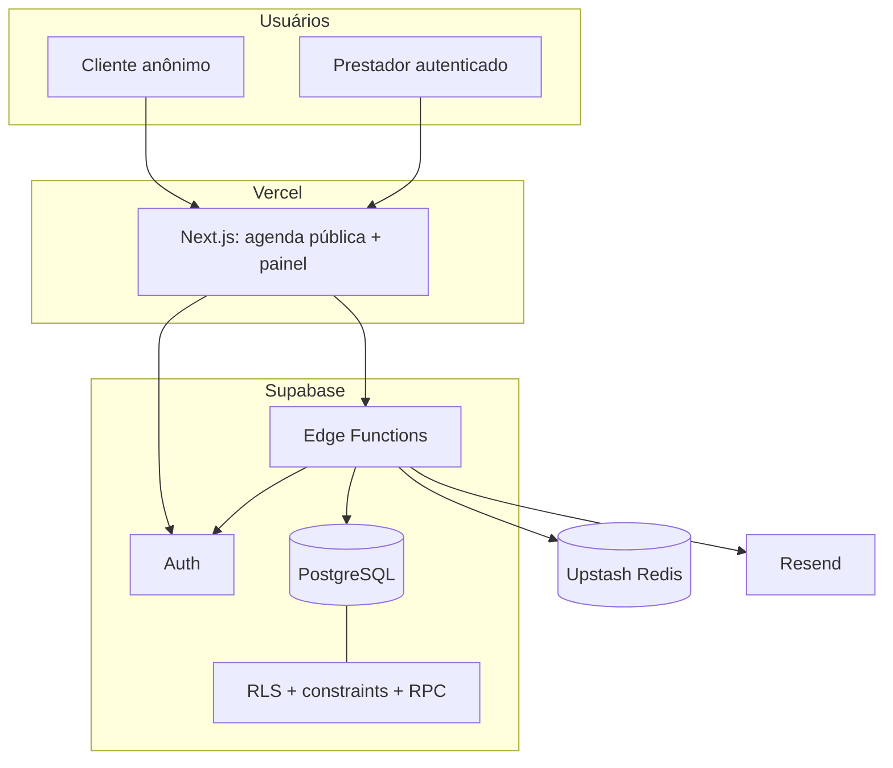
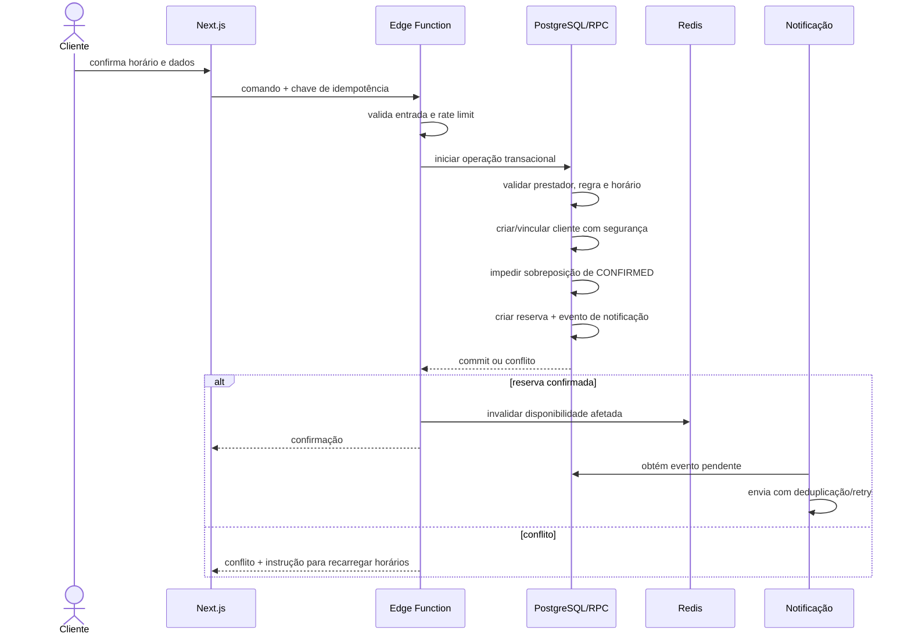

# Stack técnica e arquitetura

Este documento descreve a stack **existente**, a arquitetura **planejada** e as decisões **ainda pendentes** do Sistema de Agendamento. Seu objetivo é impedir que intenção arquitetural, dependência instalada e funcionalidade pronta sejam tratadas como sinônimos.

> [!IMPORTANT]
> O repositório atual é um scaffold Next.js. As integrações com Supabase, PostgreSQL, Edge Functions, Upstash Redis, Resend e Vercel representam a arquitetura-alvo consolidada no Trello. Elas ainda precisam de ADR, configuração, código, testes e evidência operacional.

## Sumário

- [Convenções de status](#convenções-de-status)
- [Direcionadores arquiteturais](#direcionadores-arquiteturais)
- [Resumo da stack](#resumo-da-stack)
- [Versões verificadas](#versões-verificadas)
- [Arquitetura lógica](#arquitetura-lógica)
- [Fronteiras e responsabilidades](#fronteiras-e-responsabilidades)
- [Aplicação web](#aplicação-web)
- [API e casos de uso](#api-e-casos-de-uso)
- [Autenticação e autorização](#autenticação-e-autorização)
- [Persistência e modelo de dados](#persistência-e-modelo-de-dados)
- [Transações, concorrência e idempotência](#transações-concorrência-e-idempotência)
- [Disponibilidade e cache](#disponibilidade-e-cache)
- [Emails e processamento resiliente](#emails-e-processamento-resiliente)
- [PWA e estratégia offline](#pwa-e-estratégia-offline)
- [Contratos e validação](#contratos-e-validação)
- [Estrutura-alvo do repositório](#estrutura-alvo-do-repositório)
- [Ambientes, configuração e segredos](#ambientes-configuração-e-segredos)
- [CI/CD e deploy](#cicd-e-deploy)
- [Observabilidade e operação](#observabilidade-e-operação)
- [Estratégia de testes](#estratégia-de-testes)
- [Desempenho e orçamento de frontend](#desempenho-e-orçamento-de-frontend)
- [Segurança e privacidade](#segurança-e-privacidade)
- [Custos e limites dos serviços](#custos-e-limites-dos-serviços)
- [Dependências e versionamento](#dependências-e-versionamento)
- [ADRs e decisões pendentes](#adrs-e-decisões-pendentes)
- [Sequência de implementação](#sequência-de-implementação)
- [Critérios para considerar a stack operacional](#critérios-para-considerar-a-stack-operacional)
- [Fontes](#fontes)

## Convenções de status

| Status | Significado |
| --- | --- |
| Implementado | Presente e verificável no código ou configuração atual |
| Instalado, não utilizado | Dependência/configuração presente, mas sem funcionalidade de domínio associada |
| Planejado | Parte da direção arquitetural registrada, ainda não implementada |
| Proposto | Recomendação que exige aceite explícito antes de virar regra |
| Pendente | Escolha bloqueada por decisão de produto ou arquitetura |

Sempre que este documento usa “deve”, a frase deriva de requisito ou controle necessário. Quando usa “recomenda-se” ou “proposto”, a escolha ainda precisa ser registrada em ADR ou decisão de produto.

## Direcionadores arquiteturais

A stack foi escolhida para atender os seguintes direcionadores:

1. **Mobile-first e baixo consumo de dados:** clientes acessam principalmente pelo celular, possivelmente em rede limitada.
2. **Cliente sem conta:** consulta, reserva e cancelamento não podem depender de autenticação tradicional.
3. **Isolamento por prestador:** dados de agenda e clientes de um prestador não podem ser acessados por outro.
4. **Consistência transacional:** duas requisições concorrentes nunca podem confirmar reservas sobrepostas para o mesmo prestador.
5. **Operação enxuta:** serviços gerenciados reduzem a carga operacional inicial da equipe do TCC.
6. **Resposta rápida de disponibilidade:** leituras podem usar cache, sem transformar o cache em fonte de verdade.
7. **Histórico auditável:** cancelamento tende a alterar status, não apagar a reserva.
8. **Manutenibilidade:** TypeScript, módulos coesos, contratos explícitos e separação entre apresentação, domínio e dados.
9. **Segurança por camadas:** validação, JWT, autorização, RLS, constraints e segredos separados por ambiente.
10. **Evolução controlada:** lembretes, reagendamento, cobrança e integrações adicionais permanecem fora do primeiro MVP.

## Resumo da stack

| Camada | Tecnologia | Papel | Estado |
| --- | --- | --- | --- |
| Linguagem | TypeScript | Web, contratos e código compatível com as Edge Functions | Implementado no web; planejado nas demais camadas |
| Framework web | Next.js App Router | Agenda pública, painel autenticado, renderização e integração | Implementado como scaffold |
| UI | React | Componentes e interação | Implementado como scaffold |
| Estilos | Tailwind CSS + PostCSS | Utilitários e pipeline CSS | Instalado, ainda sem UI do produto |
| Fontes | `next/font` com Geist | Carregamento otimizado de fonte | Implementado no layout padrão |
| Qualidade estática | ESLint + eslint-config-next | Regras TypeScript e Core Web Vitals | Implementado |
| Gerenciador de pacotes | npm + lockfile v3 | Instalação reproduzível | Implementado |
| Hospedagem web | Vercel | Build, deploy e entrega do Next.js | Planejado |
| Autenticação | Supabase Auth | Identidade do prestador, sessão e JWT | Parcial: sessão e login no web; projeto Auth ainda não configurado |
| API | Supabase Edge Functions | Validação, autorização e orquestração dos casos de uso | Planejado |
| Banco | Supabase PostgreSQL | Fonte de verdade, constraints, transações, RLS e histórico | Planejado |
| Cache | Upstash Redis | Cache de disponibilidade e apoio a controles de tráfego | Planejado |
| Email | Resend | Confirmações e cancelamentos | Planejado |
| PWA | Manifest + service worker a definir | Instalação e experiência segura em conectividade limitada | Planejado |
| Testes | Ferramentas a selecionar | Unitário, integração, banco, E2E, acessibilidade e carga | Pendente de ADR |
| CI/CD | Plataforma a confirmar | Gates, preview, homologação e produção | Planejado |
| Observabilidade | Ferramentas a selecionar | Logs, métricas, tracing, alertas e auditoria | Pendente de ADR |

## Versões verificadas

### Dependências declaradas diretamente

| Pacote | Faixa declarada | Versão instalada na inspeção | Observação |
| --- | --- | --- | --- |
| `next` | `16.3.5` | `16.3.5` | App Router; versão exata no `package.json` |
| `react` | `19.2.8` | `19.2.8` | versão exata |
| `react-dom` | `19.2.8` | `19.2.8` | versão exata |
| `typescript` | `^5` | `5.9.3` | compilação estrita e sem emissão |
| `tailwindcss` | `^4` | `4.3.3` | importado em `app/globals.css` |
| `@tailwindcss/postcss` | `^4` | `4.3.3` | plugin ativo em `postcss.config.mjs` |
| `eslint` | `^9` | `9.39.5` | flat config |
| `eslint-config-next` | `16.3.5` | `16.3.5` | Core Web Vitals e TypeScript |
| `@types/node` | `^20` | `20.19.43` | tipos não definem o runtime efetivo |
| `@types/react` | `^19` | `19.3.0` | dependência de desenvolvimento |
| `@types/react-dom` | `^19` | `19.3.0` | dependência de desenvolvimento |

### Ferramentas locais observadas

| Ferramenta | Versão observada | Política do projeto |
| --- | --- | --- |
| Node.js | `24.21.0` | Não fixada |
| npm | `11.19.0` | Não fixada |
| lockfile npm | versão 3 | Versionado |

As versões locais são evidência da máquina inspecionada em 14 de setembro de 2026, não uma matriz oficial. INIT-01 deve fixar o runtime suportado por `engines`, gerenciador de versões ou arquivo equivalente, além de validar compatibilidade com Next.js, Vercel, Supabase CLI e CI.

### Configuração TypeScript atual

- `strict: true`;
- `noEmit: true`;
- `isolatedModules: true`;
- `moduleResolution: bundler`;
- bibliotecas `dom`, `dom.iterable` e `esnext`;
- JSX com `react-jsx`;
- alias `@/*` apontando para a raiz;
- arquivos `.ts`, `.tsx` e `.mts` incluídos.

### Configuração de lint atual

O flat config aplica:

- `eslint-config-next/core-web-vitals`;
- `eslint-config-next/typescript`;
- ignores para `.next`, `out`, `build` e `next-env.d.ts`.

### Regra operacional específica do framework

O arquivo `AGENTS.md` registra que a versão atual do Next.js contém mudanças incompatíveis com conhecimento anterior. Antes de alterar código do framework, é obrigatório consultar a documentação correspondente em `node_modules/next/dist/docs/` e observar avisos de depreciação.

## Arquitetura lógica



### Direção das dependências

```text
interface web → aplicação/casos de uso → portas → adapters externos
                                          ├─ PostgreSQL
                                          ├─ Supabase Auth
                                          ├─ Upstash Redis
                                          └─ Resend
```

Regras de domínio não devem importar componentes React, cliente HTTP, SDK de email ou SDK de cache. Adapters implementam portas definidas pela aplicação. A camada de apresentação converte eventos de UI em comandos e respostas em estados visuais.

## Fronteiras e responsabilidades

### Browser

Responsável por:

- renderizar a interface;
- coletar e validar antecipadamente entradas por usabilidade;
- manter sessão do prestador conforme a integração oficial de Auth;
- enviar comandos para a API;
- exibir estados de sucesso, conflito, indisponibilidade e erro;
- nunca decidir sozinho se um horário pode ser confirmado.

Não pode conter:

- chave privilegiada;
- token do Upstash;
- chave do Resend;
- lógica de autorização confiável somente no cliente;
- cache persistente de tokens de cancelamento ou PII;
- confirmação offline de reserva.

### Aplicação Next.js

Responsável por:

- agenda pública e painel em uma única aplicação;
- rotas, layouts, metadata e experiência responsiva;
- separação entre componentes server/client segundo a necessidade real;
- integração com Auth e API;
- otimização de payload, fontes, imagens e navegação;
- proteção da experiência privada sem tratar redirect de UI como autorização de servidor.

### Edge Functions

Responsáveis por:

- validar payload, parâmetros e headers;
- verificar JWT nas operações privadas;
- identificar o prestador autenticado;
- autorizar recurso e ação;
- aplicar casos de uso;
- chamar RPC/transação do banco;
- consultar e invalidar cache;
- registrar eventos de notificação;
- aplicar CORS por ambiente e rate limit público;
- mapear falhas internas para erros estáveis sem dados sensíveis;
- propagar um request ID sem PII.

### PostgreSQL

Responsável por:

- estado autoritativo;
- unicidade e integridade referencial;
- consistência temporal;
- prevenção final de sobreposição;
- transações de reserva e cancelamento;
- RLS e permissões mínimas;
- histórico e auditabilidade necessárias;
- suporte a consultas eficientes por prestador e data.

### Redis

Responsável somente por acelerar leitura e, se aprovado, controles auxiliares como rate limiting. Uma resposta de cache nunca substitui a revalidação transacional na criação da reserva.

### Resend

Responsável por transportar emails. Estado de entrega, retry e deduplicação permanecem responsabilidade da aplicação e de sua persistência.

## Aplicação web

### Organização por áreas

A mesma aplicação atende:

- **área pública:** perfil por slug, datas, disponibilidade, reserva e confirmação de cancelamento;
- **área privada:** autenticação, perfil, grupos, regras, exceções, agenda e clientes;
- **área operacional mínima:** páginas de erro, indisponibilidade e suporte, sem expor detalhes internos.

### Separação interna sugerida

```text
feature/
├── domain/          # entidades, valores e regras puras
├── application/     # casos de uso do frontend e portas
├── data/            # clients/adapters e mapeamentos
├── presentation/    # componentes, hooks e estados de tela
└── index.ts          # superfície pública deliberada
```

Essa estrutura é uma diretriz, não um pedido para criar abstrações vazias. Um módulo deve surgir em torno de uma capacidade do produto — perfil, disponibilidade, reservas, agenda, clientes — e não apenas em torno do tipo do arquivo. A camada atual de invoke/hooks está em `src/features` e documentada em `docs/integracao.md`.

### Renderização e fetching

A estratégia deve ser escolhida por rota:

- conteúdo público estável pode aproveitar renderização de servidor e cache controlado;
- disponibilidade é dinâmica e precisa refletir invalidações;
- painel exige sessão e dados privados;
- mutations sempre chamam uma fronteira de servidor;
- conteúdo com token de cancelamento não deve ser pré-renderizado, indexado ou armazenado em cache público.

Não se deve definir ISR, revalidation ou cache do framework antes de mapear a interação com Upstash e com a invalidação de domínio. Duas camadas de cache sem política conjunta podem servir disponibilidade obsoleta.

### Estilos e design system

Tailwind está instalado, mas os anexos não definem biblioteca visual ou design system. Antes de consolidar componentes, decidir:

- tokens de cor, espaçamento, tipografia e elevação;
- temas e comportamento de contraste;
- componentes de formulário e feedback;
- calendário e seleção de horários acessíveis;
- estados de disponibilidade indicados por texto e semântica;
- convenção para classes e variantes;
- política para dependências de componentes de terceiros.

## API e casos de uso

### Capacidades esperadas

A API deve representar casos de uso, não CRUD irrestrito de tabelas:

- autenticar/obter sessão permanece no Supabase Auth;
- consultar e atualizar perfil do prestador;
- manter grupos e regras de disponibilidade;
- manter exceções;
- consultar disponibilidade pública;
- confirmar reserva;
- consultar agenda e clientes autorizados;
- cancelar como prestador;
- validar e cancelar como portador de token.

### Convenção de resposta

Contratos exatos ainda precisam ser aprovados, mas toda resposta deve permitir distinguir:

- sucesso;
- entrada inválida com campos identificáveis;
- não autenticado;
- não autorizado;
- recurso não encontrado sem enumeração indevida;
- conflito de horário;
- operação já aplicada/idempotente;
- dependência temporariamente indisponível;
- falha interna com request ID.

### Health check

O health check deve:

- confirmar que a função responde;
- não retornar segredo, string de conexão, versão sensível ou PII;
- separar, se necessário, liveness de readiness;
- não causar carga desnecessária em banco, Redis ou email;
- ter comportamento conhecido em ambiente local e hospedado.

### CORS e entradas públicas

- origens permitidas variam por ambiente;
- curingas em produção exigem justificativa explícita;
- endpoints públicos recebem rate limiting e validação rigorosa;
- preflight deve ser tratado sem vazar configuração;
- ausência de CORS no browser não substitui autenticação ou autorização no servidor.

## Autenticação e autorização

### Supabase Auth

Supabase Auth mantém credenciais e provedores sociais. Senhas não pertencem a uma tabela de perfil da aplicação. A aplicação armazena somente a relação necessária entre a identidade autenticada e o perfil de prestador.

### JWT

O JWT demonstra uma sessão emitida pelo Auth, mas o fluxo privado ainda precisa:

1. validar assinatura, expiração e claims exigidas;
2. obter o identificador confiável do usuário;
3. mapear usuário para prestador;
4. verificar que o recurso pertence a esse prestador;
5. executar a operação no contexto correto;
6. evitar registrar o token.

### RLS

RLS é defesa essencial, mas não isolada. Políticas devem cobrir `SELECT`, `INSERT`, `UPDATE` e `DELETE` conforme cada tabela. Testes precisam provar acesso com:

- prestador A;
- prestador B;
- usuário autenticado sem perfil válido;
- usuário anônimo;
- caminho público controlado;
- operação interna privilegiada.

Uma chave `service_role` pode contornar RLS. Seu uso não equivale a isolamento automático e só é aceitável atrás de autorização explícita, validação e escopo mínimo.

### Cancelamento por token

O token deve ser:

- imprevisível e de entropia adequada;
- específico para uma reserva e uma finalidade;
- armazenado de forma que uma leitura indevida do banco não revele diretamente o valor utilizável, se a estratégia aprovada permitir hash;
- comparado sem exposição em respostas;
- excluído de logs, URLs de analytics e caches;
- sujeito a ciclo de vida definido em DEC-04.

O `GET` exibe confirmação. Uma ação explícita, idealmente `POST`, aplica o cancelamento idempotente.

## Persistência e modelo de dados

O schema ainda não existe. O modelo abaixo é **conceitual** e depende de DEC-01, DEC-02 e DEC-03.

| Conceito | Responsabilidade | Invariantes esperados |
| --- | --- | --- |
| Identidade Auth | credencial e sessão do prestador | gerenciada pelo Supabase Auth |
| Perfil do prestador | nome, contato, slug e timezone | vínculo único com Auth; slug único; campos públicos projetados |
| Grupo de disponibilidade | agrupar regras recorrentes e ativação | somente grupos ativos geram slots |
| Regra semanal | dia e intervalo recorrente | dia válido; início anterior ao fim; regra de conflito definida |
| Exceção | bloquear ou abrir intervalo específico | intervalo válido; precedência definida; fuso consistente |
| Cliente/vínculo | dados mínimos informados numa reserva | isolamento conforme DEC-03; email normalizado; sem sobrescrita anônima indevida |
| Reserva | prestador, cliente, início, fim e status | status válido; timestamps; sem sobreposição entre confirmadas |
| Idempotência | deduplicar comandos repetidos | chave e escopo únicos; mesma requisição não repete efeitos |
| Evento de notificação | entrega resiliente de email | deduplicação, tentativas, estado e erro seguro |

### Tipos e constraints esperados

- chaves estrangeiras para relações de domínio;
- unicidade de slug;
- enums ou checks para status e tipo de exceção;
- check de `início < fim`;
- check de weekday no domínio adotado, proposto como `1..7`;
- timestamps com fuso para eventos absolutos;
- timezone IANA no prestador, se DEC-01 aprovar;
- índices por prestador/data/status conforme os planos de consulta;
- restrição no banco contra sobreposição de reservas `CONFIRMED` do mesmo prestador;
- timestamps de criação e atualização;
- cancelamento sem exclusão física, se DEC-04 confirmar.

### Modelo de identidade do cliente

DEC-03 precisa escolher e documentar uma das abordagens:

1. **Cliente pertencente ao prestador:** unicidade por `(provider_id, email_normalizado)`; reduz risco de cruzamento entre negócios.
2. **Identidade global + vínculo:** cliente global separado de uma entidade de relacionamento com cada prestador; exige regras mais complexas de atualização e privacidade.

Em ambas:

- email informado sem login não prova identidade;
- resposta pública não informa se um cadastro já existia;
- dados enviados por anônimo não sobrescrevem silenciosamente dados anteriores;
- retenção, exclusão e base de tratamento precisam de responsável e documentação;
- consultas privadas retornam somente vínculos autorizados.

### Migrations e seeds

- toda mudança de schema deve ser uma migration versionada;
- migrations devem subir um ambiente vazio de forma reproduzível;
- rollback ou procedimento de recuperação deve acompanhar mudanças relevantes;
- seeds devem conter exclusivamente dados fictícios;
- políticas RLS e grants fazem parte da migration, não de ajuste manual oculto;
- funções/RPC e constraints são versionadas junto ao schema;
- mudanças destrutivas precisam de plano de compatibilidade e recuperação.

## Transações, concorrência e idempotência

### Fluxo transacional da reserva



### Regras fundamentais

- o horário visto pelo cliente é uma fotografia, não uma garantia;
- o banco revalida a disponibilidade ao confirmar;
- duas tentativas concorrentes sobrepostas resultam em no máximo uma `CONFIRMED`;
- a resposta perdendo-se após commit não pode fazer o retry criar outra reserva;
- chave de idempotência tem escopo, validade e associação ao payload definidos;
- uma transação não é composta por várias chamadas HTTP autônomas;
- erro de email posterior ao commit não desfaz silenciosamente a reserva;
- falha de invalidação deve ser observável e recuperável.

### Cancelamento

O cancelamento planejado:

1. autentica o prestador ou valida o token;
2. autoriza somente a reserva alvo;
3. verifica o estado atual;
4. muda para `CANCELLED`, se DEC-04 aprovar;
5. preserva histórico;
6. registra notificação aplicável;
7. confirma a transação;
8. invalida a disponibilidade;
9. permite que o mesmo intervalo seja reservado novamente;
10. responde de forma idempotente se a reserva já estava cancelada.

## Disponibilidade e cache

### Cálculo autoritativo

A disponibilidade de uma data resulta da combinação de:

1. timezone do prestador;
2. grupos ativos;
3. regras recorrentes do dia da semana;
4. exceções de bloqueio e horário extra;
5. duração e passo dos slots;
6. antecedência e horizonte;
7. reservas confirmadas;
8. regra de precedência aprovada.

DEC-01 precisa fechar os itens ainda ambíguos antes da implementação definitiva.

### Papel do Upstash Redis

O cache atende consultas públicas repetidas. Uma chave conceitual deve incluir, no mínimo:

```text
availability:{provider_id}:{local_date}:{timezone_or_rule_version}:{data_version}
```

O formato final é um detalhe de implementação, mas precisa evitar colisão entre prestadores, datas, fusos e versões incompatíveis.

### Política esperada

- TTL configurável por ambiente;
- somente dados públicos mínimos;
- nenhum nome, email, telefone, JWT ou token de cancelamento;
- cache miss consulta o banco e repopula;
- indisponibilidade do Redis faz fallback ao banco;
- confirmação de reserva sempre consulta o banco;
- resposta inclui observabilidade de hit/miss apenas em logs internos seguros;
- serialização possui versão para permitir evolução.

### Matriz de invalidação

| Mutação | Chaves/datas afetadas |
| --- | --- |
| Criar, alterar ou remover regra semanal | todas as datas no horizonte em que a regra se aplica |
| Ativar/desativar grupo | todas as datas cobertas pelas regras do grupo |
| Criar/alterar/remover bloqueio | todas as datas locais tocadas pelo intervalo |
| Criar/alterar/remover horário extra | todas as datas locais tocadas pelo intervalo |
| Confirmar reserva | data(s) local(is) tocada(s) pela reserva |
| Cancelar reserva | data(s) local(is) anteriormente ocupada(s) |
| Alterar timezone/duração/passo | todo o horizonte materializado ou versão global do prestador |

Para evitar repopulação com dado antigo logo após um `DEL`, recomenda-se versionamento lógico por prestador ou estratégia equivalente. Falha de invalidação requer retry e alerta. A estratégia final deve ser testada com mutações concorrentes.

## Emails e processamento resiliente

### Eventos mínimos

- confirmação da reserva ao cliente;
- cancelamento feito pelo prestador;
- cancelamento feito pelo próprio cliente, se DEC-04 aprovar.

Lembretes permanecem fora do MVP até decisão explícita.

### Entrega confiável

Uma reserva confirmada e seu evento de notificação devem ser persistidos no mesmo limite transacional ou por mecanismo com garantia equivalente. Recomenda-se o padrão outbox:

1. transação grava reserva e evento pendente;
2. processador busca eventos elegíveis;
3. envio ao Resend usa chave de deduplicação;
4. sucesso registra identificador e horário;
5. falha transitória agenda retry com backoff;
6. falha permanente fica visível para operação;
7. conteúdo sensível não aparece em logs.

### Conteúdo e links

- templates devem ser versionados e testados;
- remetente e domínio precisam ser verificados por ambiente;
- links usam origem correspondente ao ambiente;
- token não entra em parâmetros de analytics;
- email não expõe dados desnecessários;
- cancelamento por link abre confirmação e não altera estado em `GET`;
- reenvio não cria uma nova reserva.

## PWA e estratégia offline

### Objetivo

Oferecer experiência instalável e resiliente para navegação em celulares sem comprometer a consistência das reservas.

### Recursos planejados

- web app manifest;
- ícones próprios e metadados;
- display e escopo definidos;
- service worker com estratégia explícita;
- página/estado offline;
- atualização controlada dos assets;
- teste de instalação e atualização.

### O que pode ser armazenado

- shell estático da aplicação;
- assets versionados;
- mensagens e ajuda não sensíveis;
- eventualmente uma projeção pública curta, se a política de expiração e privacidade for aprovada.

### O que não deve ser armazenado

- JWT ou credencial privilegiada;
- dados de cliente;
- token de cancelamento;
- agenda privada;
- confirmação de reserva pendente tratada como sucesso;
- resposta pública além do necessário ou sem expiração adequada.

Quando offline, a aplicação deve comunicar que não pode confirmar ou cancelar até recuperar comunicação com o servidor.

## Contratos e validação

### Pacote compartilhado

`packages/contracts` é destinado a tipos e schemas independentes de runtime, por exemplo:

- identificadores e enums públicos;
- DTO de disponibilidade;
- comando e resultado de reserva;
- erros estáveis de API;
- comando e resultado de cancelamento.

Não deve conter:

- imports de React/Next.js;
- acesso direto a banco;
- SDK do Upstash ou Resend;
- variáveis de ambiente;
- código que dependa exclusivamente de Node quando também executado em Edge Functions;
- entidades de persistência expostas como contrato público.

### Validação em camadas

- browser valida por experiência, mas não é confiável;
- API valida forma, tamanho, formato e enum;
- aplicação valida regra e autorização;
- banco garante invariantes e concorrência;
- dados de saída passam por projeção explícita.

A biblioteca de schema ainda não foi escolhida. Essa escolha deve considerar compatibilidade de runtime, inferência TypeScript, tamanho do bundle e geração/consumo de contratos.

## Estrutura-alvo do repositório

```text
app-agendamento/
├── apps/
│   └── web/
│       ├── app/
│       │   ├── (public)/
│       │   ├── (auth)/
│       │   └── (dashboard)/
│       ├── src/
│       │   ├── features/
│       │   ├── shared/
│       │   └── config/
│       ├── public/
│       └── package.json
├── packages/
│   └── contracts/
│       ├── src/
│       └── package.json
├── supabase/
│   ├── functions/
│   │   ├── _shared/
│   │   ├── availability/
│   │   ├── bookings/
│   │   └── cancellations/
│   ├── migrations/
│   ├── tests/
│   ├── seed.sql
│   └── config.toml
├── docs/
│   ├── adr/
│   ├── requirements/
│   ├── diagrams/
│   └── operations/
├── infra/
├── .github/workflows/
├── .env.example
├── package.json
├── package-lock.json
├── README.md
└── STACK.md
```

Os nomes exatos de rotas e pastas são propostos. A ADR deve definir workspaces, scripts raiz, regras de importação e compatibilidade de runtime antes da migração.

### Regras de dependência do monorepo

- `apps/web` pode depender de `packages/contracts`;
- Edge Functions podem consumir contratos compatíveis com seu runtime;
- `contracts` não depende dos apps ou de adapters;
- migrations não importam código da interface;
- nenhum módulo importa internals de outro módulo fora da superfície pública;
- configuração de infraestrutura não contém segredo;
- documentação acompanha decisões e runbooks.

## Ambientes, configuração e segredos

### Ambientes mínimos

| Ambiente | Finalidade | Dados | Deploy |
| --- | --- | --- | --- |
| Local | desenvolvimento e testes rápidos | fictícios/seed | máquina do desenvolvedor |
| Preview | revisão de branch/PR | fictícios ou isolados | efêmero, sem credenciais de produção |
| Homologação | validação integrada e evidências | controlados, não produtivos | estável e próximo de produção |
| Produção | usuários reais | reais, protegidos e com retenção definida | promovido após gates |

### Categorias de configuração

Os nomes abaixo são exemplos a confirmar, não um contrato já implementado:

| Categoria | Exposição | Exemplos conceituais |
| --- | --- | --- |
| URL pública da aplicação | pública | origem usada em links e redirects |
| Supabase URL/chave anon | pública conforme modelo do provedor | inicialização do Auth/cliente permitido |
| Supabase privilegiado | somente servidor | operação interna excepcional |
| Upstash REST URL/token | somente servidor | cache e rate limit |
| Resend API key/remetente | somente servidor | entrega de email |
| CORS/origens | servidor, configuração | allowlist por ambiente |
| TTL/rate limit | não secreto | parâmetros operacionais |
| observabilidade | mista | endpoint público quando seguro; token no servidor |

### Política de segredos

- segredos nunca entram no Git;
- `.env.example` contém somente nomes e valores fictícios;
- segredo de produção não é usado localmente;
- acesso segue menor privilégio;
- rotação tem responsável e procedimento;
- previews recebem credenciais isoladas;
- build não imprime segredo;
- erros e request dumps passam por redaction;
- credenciais antigas são revogadas após rotação.

## CI/CD e deploy

### Pipeline proposto para pull request

1. instalação por `npm ci`;
2. verificação de formatação, quando configurada;
3. lint;
4. TypeScript;
5. testes unitários e de contrato;
6. testes de banco/migrations em instância descartável;
7. build web;
8. varreduras de dependência e segredo;
9. preview sem dados de produção;
10. testes E2E e acessibilidade adequados ao risco.

### Promoção

```text
branch/PR → preview → revisão → merge → homologação → validação → produção
```

### Banco e deploy

- migration precisa ser compatível com a versão da aplicação em rollout;
- mudança incompatível usa estratégia expand/migrate/contract quando necessário;
- backup não substitui teste de restauração;
- deploy web e migration têm ordem explícita;
- rollback de código considera que migration talvez não seja reversível automaticamente;
- funções e contratos são promovidos de modo coordenado;
- falha parcial produz procedimento operacional conhecido.

### Vercel

Vercel é a hospedagem planejada para a aplicação web. Antes de produção, definir:

- projeto e regiões;
- domínios e redirects;
- variáveis por ambiente;
- previews e acesso a previews;
- limites de build/runtime;
- logs e retenção;
- política de rollback;
- proteção contra exposição de dados em cache/CDN.

## Observabilidade e operação

### Logs estruturados

Campos recomendados:

- timestamp;
- nível;
- ambiente;
- serviço/função;
- versão/commit;
- request ID;
- caso de uso;
- resultado e duração;
- categoria de erro;
- cache hit/miss;
- número da tentativa de notificação.

Não registrar:

- JWT;
- `service_role`;
- token de cancelamento;
- senha;
- corpo completo com nome, email ou telefone;
- dados brutos de provedores sem redaction.

### Métricas mínimas

- volume e latência da disponibilidade, separados por hit/miss;
- p50/p95/p99 por endpoint relevante;
- taxa de conflito de reserva;
- taxa de erro por função;
- falha e latência do Redis;
- backlog, tentativas e falhas de email;
- invalidações e retries;
- autenticação falha/sucesso em nível agregado;
- Core Web Vitals e resultado Lighthouse controlado;
- consumo por serviço para acompanhamento de custo.

### Alertas

Alertas devem ter limiar, janela, severidade, responsável e runbook. Exemplos:

- aumento sustentado de erro de reserva;
- indisponibilidade do banco;
- falha de invalidação;
- backlog de emails crescendo;
- taxa anormal de tokens inválidos ou rate limit;
- custo/uso próximo ao limite do plano;
- falha de backup ou restauração agendada.

### Continuidade

- definir RPO e RTO antes de produção;
- configurar backup compatível com o risco;
- testar restauração, não apenas existência do backup;
- documentar incidentes e comunicação;
- registrar rollback e recuperação de migrations;
- revisar acesso operacional periodicamente.

## Estratégia de testes

### Matriz por camada

| Camada | Foco | Casos indispensáveis |
| --- | --- | --- |
| Domínio | regras puras de agenda | intervalos, bordas, fuso, precedência, passado, virada de dia |
| Aplicação | casos de uso e autorização | proprietário, anônimo, token, idempotência e erros |
| Contrato | compatibilidade web/API | payload válido/inválido, versionamento e erros estáveis |
| Banco | integridade e RLS | FKs, checks, slug, dois prestadores, anônimo, concorrência |
| Cache | correção sob otimização | hit, miss, fallback, TTL, invalidação e repopulação antiga |
| Email | resiliência | deduplicação, retry, falha permanente, links por ambiente |
| Web | comportamento visual | loading, vazio, conflito, erro, offline, sessão expirada |
| E2E | incremento completo | configurar → consultar → reservar → visualizar → cancelar |
| Acessibilidade | uso inclusivo | teclado, foco, rótulo, contraste, leitor de tela, cor |
| Desempenho | RNF-D01 a D03 | cenário reproduzível, p50/p95, Lighthouse e TBT |
| Segurança | abuso e isolamento | enumeração, CORS, rate limit, logs, token e acesso cruzado |
| Operação | recuperação | migration, rollback, backup/restore e dependência fora do ar |

### Teste concorrente de aceitação

O teste de maior criticidade deve:

1. preparar dois comandos válidos para intervalos sobrepostos do mesmo prestador;
2. dispará-los simultaneamente;
3. confirmar que no máximo uma reserva termina como `CONFIRMED`;
4. confirmar que a outra recebe conflito estável;
5. garantir que não há cliente, evento ou email duplicado indevido;
6. repetir o comando vencedor com a mesma chave de idempotência;
7. verificar que os efeitos não se repetem;
8. confirmar a invalidação da data no cache.

### Teste de isolamento

Os mesmos fixtures devem executar operações como prestador A, prestador B e anônimo, provando que consultas e alterações cruzadas falham mesmo quando o identificador do recurso é conhecido.

## Desempenho e orçamento de frontend

### Metas existentes

- disponibilidade via cache com p95 menor que 100 ms;
- Lighthouse acima de 90;
- Total Blocking Time menor ou igual a 200 ms;
- invalidação imediata das mutações relevantes.

### Lacunas de medição

Antes de aceitar resultados, definir:

- região do cliente e serviços;
- carga e concorrência;
- janela e tamanho da amostra;
- aquecimento;
- hit ou miss do cache;
- medição do servidor ou ponta a ponta;
- dispositivo, navegador e rede;
- versão das ferramentas;
- ambiente e commit testados.

### Práticas esperadas no web

- reduzir JavaScript enviado ao cliente;
- usar componente cliente somente quando necessário;
- evitar biblioteca pesada para uma interação simples;
- otimizar imagens e fontes;
- paginar listas crescentes;
- tratar loading sem layout shift excessivo;
- medir, em vez de assumir, o efeito de cache e renderização;
- não usar service worker como esconderijo para respostas privadas.

## Segurança e privacidade

### Modelo de ameaças mínimo

| Ameaça | Controle principal |
| --- | --- |
| Reserva duplicada por corrida | constraint/transação no PostgreSQL |
| Acesso de prestador a outro | autorização explícita + RLS + testes |
| Enumeração de clientes | respostas uniformes e projeção mínima |
| Sobrescrita por email anônimo | modelo DEC-03 e política de atualização |
| Cancelamento por scanner | `GET` sem efeito e ação explícita de escrita |
| Roubo de token por logs | redaction, sem analytics e ciclo de vida limitado |
| Uso indevido de `service_role` | servidor apenas, autorização e menor privilégio |
| Cache obsoleto | invalidação, versão, TTL e revalidação no banco |
| Cache de PII | payload público mínimo e política de service worker |
| Abuso de endpoint público | validação, rate limit, limites de payload e monitoramento |
| Origem não autorizada | CORS por ambiente; sem tratar CORS como autenticação |
| Falha silenciosa de email | outbox/evento, retry, métrica e alerta |
| Vazamento em preview | dados e credenciais isolados por ambiente |

### Dados pessoais

Nome, email e telefone devem ser coletados apenas no fluxo necessário. Antes de produção, definir:

- finalidade de cada campo;
- quem pode consultá-lo;
- prazo de retenção;
- procedimento de correção/exclusão;
- mascaramento em suporte;
- conteúdo permitido em log, métrica e email;
- uso de dados em testes e evidências;
- responsável por atender solicitações do titular.

Este documento não substitui avaliação jurídica de privacidade e legislação aplicável.

## Custos e limites dos serviços

O uso de serviços gerenciados reduz operação, mas cria limites e dependências comerciais. FIN-01 deve registrar, por ambiente:

- plano e custo da Vercel;
- banco, Auth, Edge Functions, tráfego e armazenamento do Supabase;
- comandos, armazenamento e transferência do Upstash;
- volume, domínio e reputação de envio no Resend;
- limites de build, execução, conexão e rate;
- alertas de consumo;
- comportamento ao alcançar quota;
- estratégia de upgrade ou degradação;
- retenção de logs e backups;
- custos previstos no teste com público-alvo.

Nenhum plano gratuito deve ser presumido como suficiente sem estimativa e teste.

## Dependências e versionamento

### Regras atuais

- versões essenciais de Next.js e React estão exatas;
- várias dependências de desenvolvimento usam `^`;
- `package-lock.json` fixa a resolução instalada;
- `npm ci` é o caminho de instalação reproduzível;
- não há política automatizada de atualização ainda.

### Política recomendada

- fixar runtime Node/npm;
- revisar changelog antes de atualização major/minor sensível;
- atualizar dependência e lockfile no mesmo PR;
- executar lint, tipos, testes, build e E2E relevantes;
- verificar documentação local específica do Next.js instalado;
- manter SDKs compatíveis com runtime web e Edge;
- ativar alertas de vulnerabilidade;
- remover dependências não utilizadas;
- registrar exceção quando uma vulnerabilidade não puder ser corrigida imediatamente.

### Tecnologias ainda não escolhidas

Precisam de decisão explícita, sem serem inferidas deste documento:

- ferramenta E2E;
- ferramenta de acessibilidade automatizada;
- biblioteca de schemas/validação;
- biblioteca de formulários;
- design system ou kit de componentes;
- mecanismo concreto de PWA/service worker;
- observabilidade e error tracking;
- ferramenta de fila/worker para outbox;
- plataforma definitiva de CI, caso não seja GitHub Actions;
- convenção de commits/releases.

Vitest (unitário + cobertura da fundação) e Prettier (com `eslint-config-prettier`) estão em uso no web.

## ADRs e decisões pendentes

### ADR de stack — obrigatória

DOC-04 só deve ser considerado aceito quando uma ADR registrar:

- contexto e direcionadores;
- decisão por tecnologia;
- alternativas consideradas;
- fronteiras web/API/banco;
- monorepo e contratos;
- runtimes e versões suportadas;
- execução local;
- estratégia de ambientes e deploy;
- segurança, custo e consequências;
- plano de reversão ou evolução.

### Decisões de produto/arquitetura bloqueadoras

| ID | Tema | Impacto técnico |
| --- | --- | --- |
| DEC-01 | Duração, slot, conflito, precedência, fuso e horizonte | schema, cálculo, índices, cache e UX |
| DEC-02 | API, transação e políticas de acesso | Edge Functions, RPC, grants, RLS e contratos |
| DEC-03 | Identidade e isolamento dos clientes | schema, unicidade, privacidade e telas |
| DEC-04 | Cancelamento, email e evolução | status, token, outbox, templates e escopo |

### Template mínimo de ADR

```markdown
# ADR-NNN — Título

- Status: proposto | aceito | substituído | rejeitado
- Data:
- Responsáveis:
- Relacionados: cards, RF, RN e RNF

## Contexto
## Forças e restrições
## Alternativas consideradas
## Decisão
## Consequências positivas
## Consequências negativas e riscos
## Plano de implementação
## Validação e evidências
## Estratégia de reversão
```

## Sequência de implementação

### Fase 0 — fechar decisões

- DEC-01 a DEC-04;
- ADR da stack;
- responsáveis, versões e limites de custo.

### Fase 1 — fundação

- INIT-01: repositório, scripts e convenções;
- INIT-02: aplicação web;
- INIT-03: estrutura de Edge Functions;
- INIT-04: banco, migrations e RLS.

### Fase 2 — serviços transversais

- INIT-05: autenticação e autorização;
- INIT-06: Redis e invalidação;
- INIT-07: email resiliente;
- INIT-08: ambientes e segredos.

### Fase 3 — entrega e operação

- INIT-09: CI/CD;
- INIT-10: observabilidade, backup, restauração e runbooks.

### Fase 4 — incremento funcional

- US-01 perfil e acesso;
- US-02 disponibilidade recorrente;
- US-03 exceções;
- US-04 consulta pública;
- US-05 reserva transacional;
- US-06 agenda e clientes;
- US-07 cancelamento seguro;
- VAL-01 validação completa.

## Critérios para considerar a stack operacional

A stack não está “pronta” apenas porque contas foram criadas. Antes de produção, deve existir evidência de:

- [ ] ADR de stack aceita;
- [ ] versões de runtime fixadas;
- [ ] execução local documentada e reproduzível;
- [ ] migrations criam schema, constraints, RPC e RLS;
- [ ] seeds contêm apenas dados fictícios;
- [ ] isolamento provado com dois prestadores e anônimo;
- [ ] reserva concorrente confirma no máximo uma operação;
- [ ] idempotência testada;
- [ ] Auth integrado sem senha em tabela de aplicação;
- [ ] Edge Functions validam, autenticam e autorizam;
- [ ] CORS e rate limit configurados por ambiente;
- [ ] cache possui hit/miss, fallback, TTL e invalidação testados;
- [ ] reserva revalida no banco independentemente do cache;
- [ ] outbox/retry de email tem deduplicação e visibilidade;
- [ ] PWA não armazena PII/tokens nem confirma offline;
- [ ] lint, tipos, testes e build são gates de CI;
- [ ] preview, homologação e produção são separados;
- [ ] segredos têm menor privilégio e rotação;
- [ ] logs possuem redaction e request ID;
- [ ] métricas e alertas possuem responsáveis e runbooks;
- [ ] backup e restauração foram testados;
- [ ] desempenho foi medido em cenário reproduzível;
- [ ] acessibilidade foi validada;
- [ ] custos e quotas foram revisados em FIN-01;
- [ ] deploy e rollback foram exercitados;
- [ ] README, STACK, Trello, ADRs e diagramas estão coerentes.

## Fontes

Este documento foi consolidado a partir do estado do repositório e do módulo `00 • Guia e documentação` do board [TCC - Agendamento](https://trello.com/b/oLMQLMpq/tcc-agendamento), consultado em 14 de setembro de 2026.

- [GUIA-01 — Como trabalhar neste quadro](https://trello.com/c/sFACOWbp/1-guia-01-como-trabalhar-neste-quadro)
- [DOC-01 — Requisitos funcionais e escopo do MVP](https://trello.com/c/eRnxd0QE/2-doc-01-requisitos-funcionais-e-escopo-do-mvp)
- [DOC-02 — Regras de negócio consolidadas](https://trello.com/c/YjpzsPUy/3-doc-02-regras-de-neg%C3%B3cio-consolidadas)
- [DOC-03 — Stakeholders e casos de uso](https://trello.com/c/zqCq21hc/4-doc-03-stakeholders-e-casos-de-uso)
- [DOC-04 — Stack e divisão dos projetos](https://trello.com/c/5z1HwxXY/5-doc-04-stack-e-divis%C3%A3o-dos-projetos)
- [DOC-05 — Requisitos não funcionais e plano de validação](https://trello.com/c/CpWBZ2qq/6-doc-05-requisitos-n%C3%A3o-funcionais-e-plano-de-valida%C3%A7%C3%A3o)
- [DEC-01 — Duração e cálculo dos horários](https://trello.com/c/ntargj6n/7-dec-01-p0-definir-dura%C3%A7%C3%A3o-e-c%C3%A1lculo-dos-hor%C3%A1rios)
- [DEC-02 — API, transação e políticas de acesso](https://trello.com/c/iYF2bJQB/8-dec-02-p0-unificar-api-transa%C3%A7%C3%A3o-e-pol%C3%ADticas-de-acesso)
- [DEC-03 — Identidade e isolamento dos clientes](https://trello.com/c/K78cXCuc/9-dec-03-p0-definir-identidade-e-isolamento-dos-clientes)
- [DEC-04 — Cancelamento, emails e evolução](https://trello.com/c/ungmwrvj/10-dec-04-p1-fechar-cancelamento-emails-e-escopo-de-evolu%C3%A7%C3%A3o)

A referência externa registrada no módulo para RLS é a [documentação do Supabase](https://supabase.com/docs/guides/database/postgres/row-level-security). Mudanças estruturais futuras devem atualizar este documento e a ADR correspondente no mesmo ciclo.
